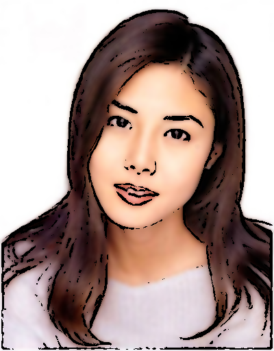
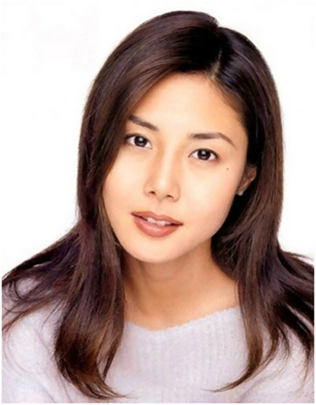
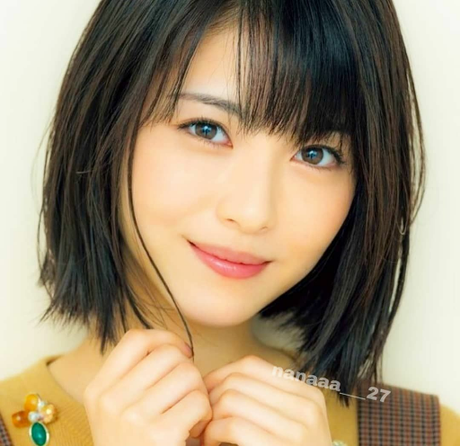
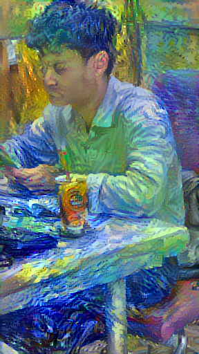
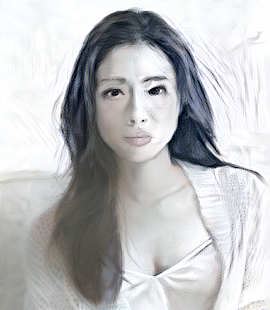

# Image Cartoonize - Style Transfer by Convolutional Neural Network

## Abstract

- __Objective__ : Nowadays, the photos and videos shared on social media can have a positive impact on the size of modern people's followership. Instead of just posting your latest selfie with well-known filters, people now can add a dose of humor to the content you share online using cartoonize application that offer caricature and sketch effects.Therefore, people no longer have to imagine how they would look like as a cartoon character since they can easily cartoonize their photo or a video with a the help of such cartoonize apps which are based on the advancement of machine learning. In this research, I am going to take you through a few effective medthods to cartoonize and add a great number of cartoon characteristics to an image

- __Method__ : From the my perspective, I have applied multiple methods from ordinary means of digital image processing to advance ways of using deep neural networks.

- __Result__ : I make the advance of multiple pretrained model such as *[VGG19](https://www.tensorflow.org/api_docs/python/tf/keras/applications/VGG19)*, *[MobileNetV3Large](https://www.tensorflow.org/api_docs/python/tf/keras/applications/MobileNetV3Large)* to act as style and content extractors

## I. Introduction

Cartoons are an inalienable part of everybody’s childhood. They remind us of happy events from the past. Besides, they are just very nice to look at. Today there are filters that let us see the world in a cartoonish mode. You can take a picture or shoot a video with you and your friends and turn it into a cartoon.


Indeed, it is one of the most important factors which decide that these websites will accepted your product image to be displyed or not in their store. It lead to the fact that I could make the most of cutting edge technology like segmentic image segmentation and digital iamge processing to achieve the things that all retailers desire - Their product image will have an elegant white or transparent background.

## II. Converting Image to Cartoon Using OpenCV


### 1. Converting image to RGB

As we can see that the input image read by OpenCV is being shown as a BGR (Blue-Green-Red) image so we need to convert it to the RGB (Red-Green-Blue).


### 2. Detecting edges of image
- Detect the edges in the image using adaptive thresholding methods.

```python
import cv2

def edge_detect(img):
    gray = cv2.cvtColor(img, cv2.COLOR_BGR2GRAY)
    gray = cv2.medianBlur(gray, 5)
    edges = cv2.adaptiveThreshold(gray, 255, cv2.ADAPTIVE_THRESH_MEAN_C, cv2.THRESH_BINARY, 9, 9)
    return edges
```


#### a. Definition of Adaptive Threshold

> The algorithm determines the threshold for a pixel based on a small region around it. So we get different thresholds for different regions of the same image which gives better results for images with varying illumination.
 - cv.ADAPTIVE_THRESH_MEAN_C: The threshold value is the mean of the    neighbourhood area minus the constant C.
 - cv.ADAPTIVE_THRESH_GAUSSIAN_C: The threshold value is a gaussian-weighted sum of the neighbourhood values minus the constant C.
The blockSize determines the size of the neighbourhood area and C is a constant that is subtracted from the mean or weighted sum of the neighbourhood pixels.

```python
cv2.adaptiveThreshold(gray, 255, cv2.ADAPTIVE_THRESH_MEAN_C, cv2.THRESH_BINARY, 9, 9)
```

#### b. Definition of MedianBlur

> The median filter run through each element of the signal (in this case the image) and replace each pixel with the median of its neighboring pixels (located in a square neighborhood around the evaluated pixel).

```python
cv2.medianBlur(img, 5)
```

### 3. Cartoonifying image
- In this step, we will be cartoonifying the image using bilateral filter method.

```python
import cv2

def cartoonize(img, edge):
    color = C
    cartoon = cv2.bitwise_and(color, color, mask=edge)
    return cartoon
```

#### a. Definition of Bilateral Filter

> cv.bilateralFilter() is highly effective in noise removal while keeping edges sharp. But the operation is slower compared to other filters. We already saw that a Gaussian filter takes the neighbourhood around the pixel and finds its Gaussian weighted average. This Gaussian filter is a function of space alone, that is, nearby pixels are considered while filtering. It doesn't consider whether pixels have almost the same intensity. It doesn't consider whether a pixel is an edge pixel or not. So it blurs the edges also, which we don't want to do.

```python
 color = cv2.bilateralFilter(img, 9, 250, 250)
```


### 4. Evaluation 
In the above demonstration, we converted a normal image into a cartoon by implementing a few lines of code using computer vision techniques. we shall have great fun using computer vision techniques.

<div align='center' style="display:flex;">
    
    
    
    
    
</div>
<hr/>
<div align='center' style="display:flex;">
    
    
    
    
</div>


## III. Converting Image to Cartoon Using Style-Transfering Deep Learning method

### 1. Motivattion

- Neural Style Transfer (NST) is one of the most fun techniques in deep learning. As seen below, it merges two images, namely: a **"content" image (C) and a "style" image (S), to create a "generated" image (G**). 

- The generated image G combines the "content" of the image C with the "style" of image S. 


- By using the technique, we can generate a cartoonized image from a style cartoonized image and the content image which we want to cartoonized

### 2. Definition of Style-Transfering Deep Learning

> Neural Style Transfer (NST) uses a previously trained convolutional network, and builds on top of that. The idea of using a network trained on a different task and applying it to a new task is called transfer learning.

> Following the original NST paper, we will use the VGG network. Specifically, we'll use VGG-19, a 19-layer version of the VGG network. This model has already been trained on the very large ImageNet database, and thus has learned to recognize a variety of low level features (at the shallower layers) and high level features (at the deeper layers).

### 3. Neural Style Transfer (NST)
 - We will build the Neural Style Transfer (NST) algorithm in three steps :

    - Build the content cost function  Jcontent(C,G)
    - Build the style cost function  Jstyle(S,G)
    - Put it together to get  J(G)=α.Jcontent(C,G) + β.Jstyle(S,G)


#### a. Computing the content lost


- nH,nW and nC are the height, width and number of channels of the hidden layer you have chosen, and appear in a normalization term in the cost.
- For clarity, note that  a(C)  and  a(G) are the 3D volumes corresponding to a hidden layer's activations.
- In order to compute the cost  Jcontent(C,G) , it might also be convenient to unroll these 3D volumes into a 2D matrix, as shown below.

```python
def compute_content_cost(a_C, a_G):
    m, n_H, n_W, n_C = a_G.get_shape().as_list()
    
    # Reshape a_C and a_G (≈2 lines)
    a_C_unrolled = tf.reshape(a_C,shape=[m, n_H*n_W, n_C])
    a_G_unrolled = tf.reshape(a_G,shape=[m, n_H*n_W, n_C])
    
    # compute the cost with tensorflow (≈1 line)
    J_content = tf.reduce_sum(tf.square(a_C_unrolled - a_G_unrolled))
    
    return J_content
```


#### b. Computing the style loss
> The style of an image can be described by the means and correlations across the different feature maps. Calculate a Gram matrix that includes this information by taking the outer product of the feature vector with itself at each location, and averaging that outer product over all locations. This Gram matrix can be calculated for a particular layer as:


- This can be implemented concisely using the tf.linalg.einsum function:

```python
def gram_matrix(input_tensor):
    result = tf.linalg.einsum('bijc,bijd->bcd', input_tensor, input_tensor)
    input_shape = tf.shape(input_tensor)
    num_locations = tf.cast(input_shape[1]*input_shape[2], tf.float32)
    return result/(num_locations)
```


#### c. Computing total cost


```python
style_weight=0.001
content_weight=1000
```


```python
def style_content_loss(outputs):
    style_outputs = outputs['style']
    content_outputs = outputs['content']

    style_loss = tf.add_n([tf.reduce_mean((style_outputs[name]-style_targets[name])**2) for name in style_outputs.keys()])

    style_loss *= style_weight / num_style_layers

    content_loss = tf.add_n([tf.reduce_mean((content_outputs[name]-content_targets[name])**2) for name in content_outputs.keys()])

    content_loss *= content_weight / num_content_layers
    
    loss = style_loss + content_loss
    return loss
```

> This is the cost of computing the total cost of content loss and style loss. However, this can cause a unwanted effect which is the generated image is so noisy. For example : 


> Therefore, we have to reduce the cost of image variation to get a better genereated image.

- TensorFlow includes a standard implementation:

```python
total_variation_weight=30
variation_loss = tf.image.total_variation(image)
```

```python
loss = style_content_loss(
    outputs,  
    style_targets   = self._targets[0],
    content_targets = self._targets[1],
    style_weight    = self._loss_Weight[0], 
    content_weight  = self._loss_Weight[1]
) + total_variation_weight * variation_loss
```

### 4. VGG19 - Pretrained Model Prepareation

#### a. Model Summary

<div align='center'>


```
Model: "vgg19"
_________________________________________________________________
Layer (type)                 Output Shape              Param #   
=================================================================
input_1 (InputLayer)         [(None, None, None, 3)]   0         
_________________________________________________________________
block1_conv1 (Conv2D)        (None, None, None, 64)    1792      
_________________________________________________________________
block1_conv2 (Conv2D)        (None, None, None, 64)    36928     
_________________________________________________________________
block1_pool (MaxPooling2D)   (None, None, None, 64)    0         
_________________________________________________________________
block2_conv1 (Conv2D)        (None, None, None, 128)   73856     
_________________________________________________________________
block2_conv2 (Conv2D)        (None, None, None, 128)   147584    
_________________________________________________________________
block2_pool (MaxPooling2D)   (None, None, None, 128)   0         
_________________________________________________________________
block3_conv1 (Conv2D)        (None, None, None, 256)   295168    
_________________________________________________________________
block3_conv2 (Conv2D)        (None, None, None, 256)   590080    
_________________________________________________________________
block3_conv3 (Conv2D)        (None, None, None, 256)   590080    
_________________________________________________________________
block3_conv4 (Conv2D)        (None, None, None, 256)   590080    
_________________________________________________________________
block3_pool (MaxPooling2D)   (None, None, None, 256)   0         
_________________________________________________________________
block4_conv1 (Conv2D)        (None, None, None, 512)   1180160   
_________________________________________________________________
block4_conv2 (Conv2D)        (None, None, None, 512)   2359808   
_________________________________________________________________
block4_conv3 (Conv2D)        (None, None, None, 512)   2359808   
_________________________________________________________________
block4_conv4 (Conv2D)        (None, None, None, 512)   2359808   
_________________________________________________________________
block4_pool (MaxPooling2D)   (None, None, None, 512)   0         
_________________________________________________________________
block5_conv1 (Conv2D)        (None, None, None, 512)   2359808   
_________________________________________________________________
block5_conv2 (Conv2D)        (None, None, None, 512)   2359808   
_________________________________________________________________
block5_conv3 (Conv2D)        (None, None, None, 512)   2359808   
_________________________________________________________________
block5_conv4 (Conv2D)        (None, None, None, 512)   2359808   
_________________________________________________________________
block5_pool (MaxPooling2D)   (None, None, None, 512)   0         
=================================================================
Total params: 20,024,384
Trainable params: 20,024,384
Non-trainable params: 0
_________________________________________________________________
```

</div>

#### b. Intermediate layers for style and content

> At a high level, in order for a network to perform image classification (which this network has been trained to do), it must understand the image. This requires taking the raw image as input pixels and building an internal representation that converts the raw image pixels into a complex understanding of the features present within the image.

```python
content_layers = ['block5_conv2'] 

style_layers = ['block1_conv1',
                'block2_conv1',
                'block3_conv1', 
                'block4_conv1', 
                'block5_conv1']
```

> This is also a reason why convolutional neural networks are able to generalize well: they’re able to capture the invariances and defining features within classes (e.g. cats vs. dogs) that are agnostic to background noise and other nuisances. Thus, somewhere between where the raw image is fed into the model and the output classification label, the model serves as a complex feature extractor. By accessing intermediate layers of the model, you're able to describe the content and style of input images.

```python
def vgg_layers(vgg, layer_names):
    vgg = tf.keras.applications.VGG19(include_top=False, weights='imagenet')

    vgg.trainable = False

    outputs = [vgg.get_layer(name).output for name in layer_names]

    model = tf.keras.Model([vgg.input], outputs)
    return model
```

### 5. Model Construction

- Declare model for Style Transfer

```python
class StyleContentModel(tf.keras.models.Model):
    def __init__(self, model, style_layers, content_layers):
        super(StyleContentModel, self).__init__()
        self.vgg =  vgg_layers(model, style_layers + content_layers)
        self.style_layers = style_layers
        self.content_layers = content_layers
        self.num_style_layers = len(style_layers)
        self.vgg.trainable = False

    def call(self, inputs):
        "Expects float input in [0,1]"
        inputs = inputs*255.0
        preprocessed_input = tf.keras.applications.vgg19.preprocess_input(inputs)
        outputs = self.vgg(preprocessed_input)
        style_outputs, content_outputs = (outputs[:self.num_style_layers], 
                                        outputs[self.num_style_layers:])

        style_outputs = [gram_matrix(style_output)
                        for style_output in style_outputs]

        content_dict = {content_name:value 
                        for content_name, value 
                        in zip(self.content_layers, content_outputs)}

        style_dict = {style_name:value
                    for style_name, value
                    in zip(self.style_layers, style_outputs)}

        return {'content':content_dict, 'style':style_dict}
```

- Reweight pretrained model VGG19 and init model to style-transfering images

```python
vgg = tf.keras.applications.VGG19(include_top=False, weights='imagenet')
style_extractor = vgg_layers(vgg, style_layers)
extractor = StyleContentModel(vgg, style_layers, content_layers)
```

### 6. Train Model
- Setup custom training process for style-transfering

```python
class Custom_Train(object):
    def __init__(self, image, optimizer, targets, loss_weight):
        self._image = image
        self._optimizer = optimizer
        self._targets = targets
        self._loss_Weight = loss_weight

    def __call__(self):
        with tf.GradientTape() as tape:
            outputs = extractor(self._image)
            loss = style_content_loss(
                outputs,  
                style_targets   = self._targets[0],
                content_targets = self._targets[1],
                style_weight    = self._loss_Weight[0], 
                content_weight  = self._loss_Weight[1]
            ) + total_variation_weight * tf.image.total_variation(image)

        grad = tape.gradient(loss, self._image)
        optimizer.apply_gradients([(grad, self._image)])
        self._image.assign(clip_0_1(self._image))
```

- Define the interface for training process:

```python
def image_style_tranfer(image, train_parameters, epochs = 10, steps_per_epoch = 100):
    start = time.time()
    step = 0
    for n in range(epochs):
        for m in range(steps_per_epoch):
            step += 1
            train_step = Custom_Train(
                image,
                train_parameters['optimizer'],
                train_parameters['targets'],
                train_parameters['loss_weight']
            )
            train_step()
            print(".", end='')
        display.clear_output(wait=True)
        display.display(tensor_to_image(image))
        print("Train step: {}".format(step))

    end = time.time()
    print("Total time: {:.1f}".format(end-start))

```

- Let's start style-training process:

```python
import copy

result_images = []
for style_image in style_images:
    style_targets = extractor(style_image)['style']
    for content_image in content_images:
        image = tf.Variable(content_image)
        content_targets = extractor(content_image)['content']
        train_parameters = {
            'optimizer'     : optimizer,
            'loss_weight'   : (style_weight, content_weight, total_variation_weight),
            'targets'       : (style_targets, content_targets)
        }
        image_style_tranfer(image, train_parameters, epochs=5)
        result_images.append(copy.deepcopy(image))
```

### 7. Evaluation
<hr/>
- The content image :
<hr/>
<div align='center' style="display:flex;">
    
    
    
    
</div>
<hr/>
- The style images :
<hr/>

<div style="display:flex;">
        
        
        
        
</div>

<hr/>
- The result images :
<hr/>
<div style="display:flex;">
    
    
    
    
    
    
</div>

<div style="display:flex;">
    
    
    
    
    
    
</div>
<hr/>
<div style="display:flex;">
    
    
    
    
    
    
</div>

<div style="display:flex;">
    
    
    
    
    
    
</div>
<hr/>
<div style="display:flex;">
    
    
    
    
    
    
</div>

<div style="display:flex;">
    
    
    
    
    
    
</div>
<hr/>
<div style="display:flex;">
    
    
    
    
    
    
</div>

<div style="display:flex;">
    
    
    
    
    
    
</div>
<hr/>

## IV. Comparision between methods

### 1. Converting Image to Cartoon Using OpenCV

> As it can be seen, the advantages of this method is 
- It is easy to be carry out and it is really easy to understand and implement 
- Additionally, this method cost very little time and memory
 
> Yet, its disadvantages are still great compare to other methods
- It seem to be a little hard-coded as user cannot add the style of the image 

### 2. Converting Image to Cartoon Using Style-Transfering Deep Learning

> As it can be seen, the advantages of this method is 
- It allow user to customize the style of the image freely
- It create high detail style of the image of the user want it to be
- Pretrained model VGG19 extract the feature of the style image and mix them effectively with the content image
 
> Yet, its disadvantages are still great compare to other methods
- It cost a greater amount of time compare to the Image Processing method
- The heavy-weight back-end of the model could be a considerable hindrance for deploying and applying it into production

## V. Final Conclusion

### 1. Converting Image to Cartoon Using OpenCV

- All image is converted under 1 seconds

### 2. Converting Image to Cartoon Using Style-Transfering Deep Learning

|Name | Image |  Dimesion | Epoch | Time Eslaspe | 
| ------ | :-----: | :-----: | ---- | ---- |
|Content 1||228 x 512   |500|53.5 seconds|
|Content 2||400 x 512   |500|71.1 seconds|
|Content 3||446 x 512   |500|75.6 seconds|
|Content 4||512 x 496   |500|81.7 seconds|

## VI. Future research
Comming Soon

## VII. Sample Codes

### 1. Converting Image to Cartoon Using OpenCV

[Colab Sources Code](https://colab.research.google.com/drive/1gUQikw_gytBVt9PHtur5wcfdGCFbtcYu?usp=sharing)

### 2. Converting Image to Cartoon Using Style-Transfering Deep Learning
[Colab Sources Code](https://colab.research.google.com/drive/1vw23gUfxWe0JC9_WShCQA91CXnIplki9?usp=sharing)

### 3. GitHub of entire research

[Github Page](https://github.com/liem18112000/ComputerVistion_Colab.git)

[Github SSH](git@github.com:liem18112000/ComputerVistion_Colab.git)


## VIII. References

OpenCV. (n.d.). https://docs.opencv.org/master. Retrieved from https://docs.opencv.org/master/d7/d4d/tutorial_py_thresholding: https://docs.opencv.org/master/d7/d4d/tutorial_py_thresholding.html

Ng, A. (n.d.). Convolution Neural Network. Retrieved from https://www.coursera.org: https://www.coursera.org/learn/convolutional-neural-networks

OpenCV. (2020, 12 3). Smoothing Images - OpenCV. Retrieved from https://docs.opencv.org: https://docs.opencv.org/master/d4/d13/tutorial_py_filtering.html

OpenCV. (n.d.). tutorial_gausian_median_blur_bilateral_filter. Retrieved from https://docs.opencv.org: https://docs.opencv.org/3.4/dc/dd3/tutorial_gausian_median_blur_bilateral_filter.html

Tensorflow. (2021, 2 3). Neural style transfer. Retrieved from https://www.tensorflow.org: https://www.tensorflow.org/tutorials/generative/style_transfer

